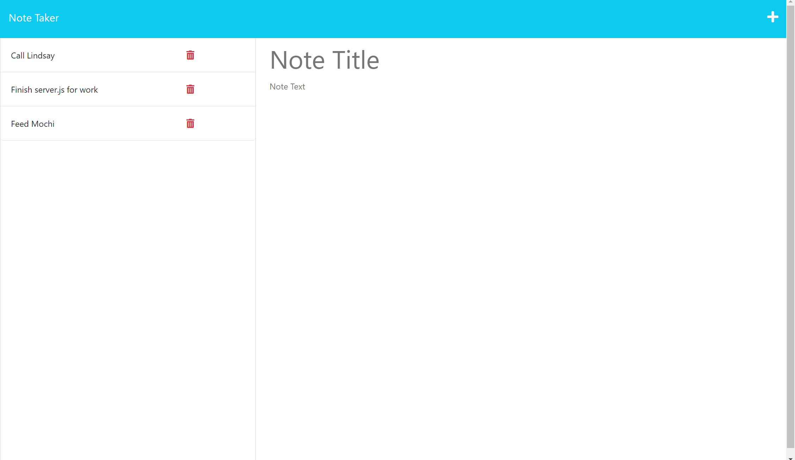

# KS Note Taker

## Description

This application is a note-taking app that can be used to write and save notes. Using an express.js back end, this app will save any typed notes and display them on the side of the page. Students were given starter code which contained html, css, and javascript, but were expected to write the server.js file, as well as any other necessary files to make the program work.

##  Instaliation

If cloning, type "npm i" into the terminal after cloning to download the required node modules.

If viewing through the deployed app link, no instaliation is necessary.

## Usage

Users will be taken to a homepage, where there is a button that can be clicked. After clicking the button, users are taken to a screen where they can type in their notes. After filling out all fields, press the save icon to save your notes. To write a new note, click the + icon. To view previous notes, click on the note title on the left side of the page. To delete notes, click the red trashcan on the left side of the page.

https://gentle-depths-95038.herokuapp.com/

## Credits

Starter code aquired from https://github.com/coding-boot-camp/miniature-eureka

## License

N/A

